# Incoming Call Flow (Streaming Mode)

This document describes the real-time streaming flow for incoming phone calls handled by the Voice Agent system.

## Overview

The system uses **Twilio Media Streams** for real-time bidirectional audio processing:

```
Phone Call → Twilio → WebSocket → TwilioStreamHandler → AI Pipeline → Audio Response
```

## Configuration

Set the following in `.env` to enable streaming mode:

```bash
TWILIO_PROCESSING_MODE=stream
```

## Architecture Overview

```mermaid
flowchart TB
    subgraph Caller["📞 Caller"]
        Phone[Phone]
    end
    
    subgraph Twilio["☁️ Twilio Cloud"]
        TwilioAPI[Voice API]
        MediaStream[Media Streams]
    end
    
    subgraph Server["🖥️ Voice Agent Server"]
        Webhook["/webhooks/twilio/incoming"]
        WSEndpoint["/webhooks/twilio/stream"]
        
        subgraph StreamHandler["TwilioStreamHandler"]
            VAD[VAD Detection]
            AudioBuffer[Audio Buffer]
            InterruptDetect[Interrupt Detection]
        end
        
        subgraph Pipeline["AI Pipeline"]
            STT["🎤 STT (Whisper)"]
            LLM["🤖 LLM (GPT)"]
            TTS["🔊 TTS (OpenAI)"]
        end
    end
    
    subgraph MongoDB["🗄️ MongoDB"]
        Agents[(agents)]
        Phones[(registered_phone_numbers)]
        Calls[(calls)]
    end
    
    Phone -->|Call| TwilioAPI
    TwilioAPI -->|POST| Webhook
    Webhook -->|Validate| Phones
    Webhook -->|Load Config| Agents
    Webhook -->|TwiML| TwilioAPI
    TwilioAPI -->|WebSocket| MediaStream
    MediaStream <-->|Audio Stream| WSEndpoint
    WSEndpoint --> StreamHandler
    
    VAD --> AudioBuffer
    AudioBuffer --> STT
    STT --> LLM
    LLM --> TTS
    TTS --> WSEndpoint
    
    StreamHandler -->|Transcripts| Calls
    
    style Caller fill:#e1f5fe
    style Twilio fill:#fff3e0
    style Server fill:#e8f5e9
    style MongoDB fill:#fce4ec
```



## Sequence Diagram


## Audio Pipeline

```mermaid
flowchart LR
    subgraph Input["📥 User Speech"]
        A1[μ-law 8kHz 8-bit] --> A2[PCM 8kHz 16-bit]
        A2 --> A3[WAV File]
    end
    
    subgraph STT["🎤 Speech-to-Text"]
        A3 --> B1[OpenAI Whisper]
        B1 --> B2[Text]
    end
    
    subgraph LLM["🤖 Language Model"]
        B2 --> C1[System Prompt]
        C1 --> C2[Conversation History]
        C2 --> C3[GPT Response]
    end
    
    subgraph TTS["🔊 Text-to-Speech"]
        C3 --> D1[OpenAI TTS]
        D1 --> D2[PCM 24kHz 16-bit]
    end
    
    subgraph Output["📤 AI Response"]
        D2 --> E1[Resample to 8kHz]
        E1 --> E2[μ-law 8-bit]
        E2 --> E3[Twilio Stream]
    end
    
    style Input fill:#e3f2fd
    style STT fill:#fff3e0
    style LLM fill:#f3e5f5
    style TTS fill:#e8f5e9
    style Output fill:#fce4ec
```



## Interrupt Handling Flow


## Key Components

### 1. Incoming Webhook (`/webhooks/twilio/incoming`)
**File:** `api_general.py` (line 1632)

- Receives call notification from Twilio
- Validates phone number is registered in MongoDB
- Loads agent configuration
- Returns TwiML with WebSocket stream URL

### 2. Stream Handler (`TwilioStreamHandler`)
**File:** `tools/phone/twilio_phone_stream.py`

Handles real-time audio processing:

| Feature | Description |
|---------|-------------|
| VAD | WebRTC Voice Activity Detection (8kHz, 20ms frames) |
| Interrupt Detection | Stops AI response when user speaks |
| Conversation History | Maintains context across turns |

### 3. Audio Processing Pipeline

#### STT (Speech-to-Text)
- **Input:** μ-law audio from Twilio (8kHz)
- **Conversion:** μ-law → WAV (using `audioop`)
- **Model:** OpenAI Whisper (configurable via agent's `sttModel`)

#### LLM (Language Model)
- **Model:** Configurable via agent's `inferenceModel` (default: gpt-4o-mini)
- **Parameters:** `temperature`, `maxTokens` from agent config
- **Context:** Full conversation history maintained per session

#### TTS (Text-to-Speech)
- **Model:** Configurable via agent's `ttsModel` (default: tts-1)
- **Voice:** Configurable via agent's `ttsVoice` (alloy, echo, fable, onyx, nova, shimmer)
- **Output:** PCM (24kHz) → μ-law (8kHz) for Twilio

## Agent Configuration

The following fields from the `agents` collection are used:

| Field | Purpose | Default |
|-------|---------|---------|
| `sttModel` | Speech-to-text model | whisper-1 |
| `inferenceModel` | LLM for responses | gpt-4o-mini |
| `ttsModel` | Text-to-speech model | tts-1 |
| `ttsVoice` | TTS voice ID | alloy |
| `greeting` | Initial greeting message | "Hello! How can I help you today?" |
| `systemPrompt` | LLM system instructions | (agent specific) |
| `temperature` | LLM temperature | 0.7 |
| `maxTokens` | Max LLM response tokens | 150 |

### Where Agent Config is Used in Code

| Config Field | File Location | Line |
|--------------|---------------|------|
| `sttModel` | `twilio_phone_stream.py` | 458 |
| `inferenceModel` | `twilio_phone_stream.py` | 500 |
| `temperature` | `twilio_phone_stream.py` | 501 |
| `maxTokens` | `twilio_phone_stream.py` | 502 |
| `ttsVoice` | `twilio_phone_stream.py` | 642 |
| `ttsModel` | `twilio_phone_stream.py` | 643 |
| `greeting` | `twilio_phone_stream.py` | 595 |
| `systemPrompt` | `twilio_phone_stream.py` | 253 |

## Audio Format Conversion

**File:** `tools/phone/audio_utils.py`

### Twilio → Whisper
```python
μ-law (8kHz, 8-bit) → PCM (8kHz, 16-bit) → WAV file
```

### OpenAI TTS → Twilio
```python
PCM (24kHz, 16-bit) → Resample to 8kHz → μ-law (8-bit)
```

## VAD Configuration

```python
VAD_AGGRESSIVENESS = 3          # High sensitivity
VAD_SAMPLE_RATE = 8000          # Twilio's rate
VAD_FRAME_DURATION_MS = 20      # Frame size
SILENCE_THRESHOLD_FRAMES = 100  # 2 seconds of silence = end of speech
```

## Interrupt Handling

The system supports interrupt detection:

1. User speaks while AI is responding
2. Grace period (500ms) to avoid AI feedback
3. Minimum 5 frames of speech to validate interrupt
4. Sends Twilio "clear" command to stop audio
5. Cancels TTS task immediately
6. Processes new user input

## MongoDB Collections Used

| Collection | Purpose |
|------------|---------|
| `registered_phone_numbers` | Phone validation |
| `agents` | Agent configuration |
| `calls` | Call logging and transcripts |

## Debugging

Check server logs for key events:

```
📞 Received incoming call webhook for CallSid: ...
Mode: STREAM. Initiating media stream to: wss://...
Stream started: call_sid=...
✅ Loaded agent config by phone number: ...
📢 Using AGENT greeting: ...
Speech detected.
User said: <transcription>
AI response: <response>
Finished streaming AI response.
```

## Troubleshooting

### Issue 1: Processing Mode Not Set to Stream
**Symptoms**: Call connects but uses recording mode instead of real-time
**Check**: Verify `.env` has `TWILIO_PROCESSING_MODE=stream`
**Fix**: Change to `stream` and restart server

### Issue 2: Agent Config Not Loading
**Symptoms**: No greeting, AI doesn't respond, call says "number does not exist"
**Check logs for**:
```
❌ No active agent found for phone number <number>
```
**Fix**: Ensure an active agent is created for the phone number with `active: true`

### Issue 3: Audio Conversion Failure
**Symptoms**: No audio playback, garbled audio
**Location**: `tools/phone/audio_utils.py`
**Fix**: Verify `audioop` module is available (standard Python library)

### Issue 4: WebSocket Connection Drops
**Symptoms**: Call connects but no audio streams
**Check logs for**:
```
Stream started: call_sid=...
```
If missing, verify ngrok URL is correctly configured in Twilio webhook settings.

### Issue 5: No Speech Detected
**Symptoms**: AI plays greeting but never responds to user
**Check logs for**:
```
Speech detected.
```
**Possible causes**:
- VAD not detecting speech (background noise issues)
- Audio buffer not filling correctly

## Related Files

| File | Description |
|------|-------------|
| `api_general.py` | Webhook endpoints |
| `tools/phone/twilio_phone_stream.py` | Stream handler |
| `tools/phone/audio_utils.py` | Audio conversion |
| `tools/understanding/speech_to_text/__init__.py` | STT tool |
| `tools/response/text_to_speech/__init__.py` | TTS tool |
| `tools/response/conversation/__init__.py` | LLM tool |

