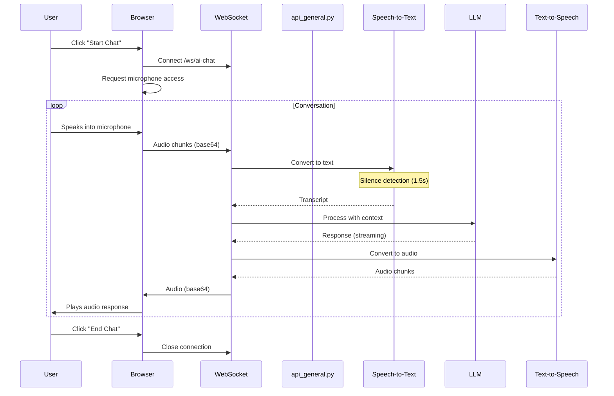
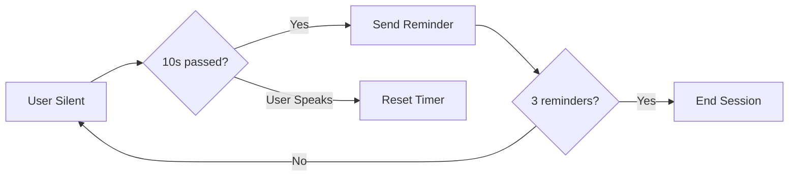

# AI Chat Flow

Browser-based real-time voice chat with AI, using microphone input and audio playback.

## Data Flow



## Inactivity Management



## Key Files

| File | Purpose |
|------|---------|
| [api_general.py](../api_general.py) | `/ws/ai-chat` WebSocket endpoint |
| [stt_provider_factory.py](../utils/stt_provider_factory.py) | Speech-to-Text |
| [tts_provider_factory.py](../utils/tts_provider_factory.py) | Text-to-Speech |

## Frontend Components

| File | Purpose |
|------|---------|
| `AIChatView.tsx` | Main chat UI component |
| Audio handling | Web Audio API for mic capture & playback |

## WebSocket Message Types

### Client → Server
```json
{"type": "audio", "data": "<base64 audio>"}
{"type": "config", "stt_model": "...", "tts_voice": "..."}
{"type": "end"}
```

### Server → Client
```json
{"type": "transcript", "text": "Hello"}
{"type": "audio", "data": "<base64 audio>"}
{"type": "inactivity_reminder", "count": 1}
{"type": "inactivity_end"}
```

## Audio Format

- **Input**: Raw PCM, 16kHz, mono
- **Output**: Varies by TTS provider (typically mp3 or pcm)
