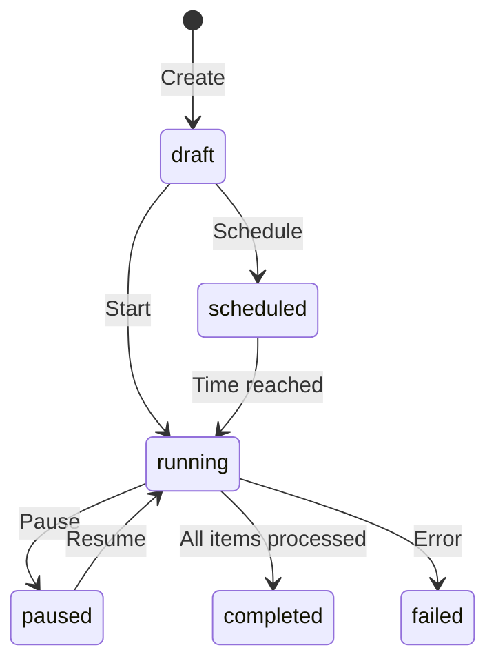
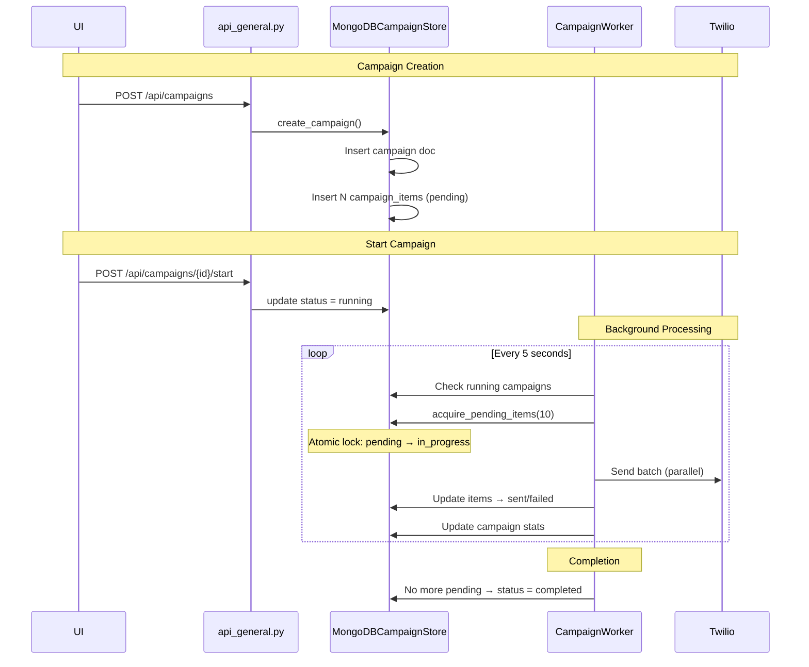
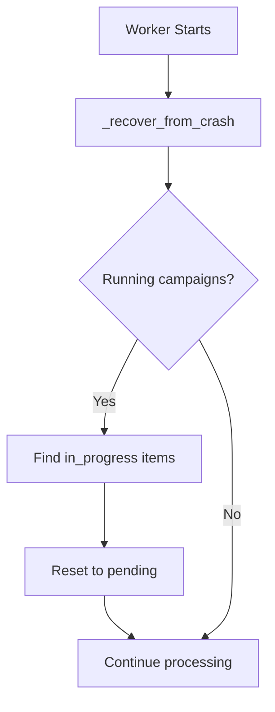

# Campaigns Flow

Full lifecycle of campaign management: creation, execution, pause/resume, and crash recovery.

## Campaign States



## Data Flow



## Crash Recovery



## Key Files

| File | Purpose |
|------|---------|
| [campaign_worker.py](../utils/campaign_worker.py) | Background worker |
| [mongodb_campaign_store.py](../databases/mongodb_campaign_store.py) | Campaign & items CRUD |
| [mongodb_campaign_execution_store.py](../databases/mongodb_campaign_execution_store.py) | Execution logs |

## Database Schema

### `campaigns` Collection
```json
{
  "_id": ObjectId,
  "name": "Marketing Blast",
  "type": "sms|voice|whatsapp",
  "status": "draft|scheduled|running|paused|completed|failed",
  "config": {
    "fromNumber": "+15551234567",
    "promptId": "...",
    "messageBody": "Hello!..."
  },
  "stats": {
    "total": 1000,
    "pending": 500,
    "sent": 480,
    "failed": 20
  },
  "progress_percent": 50.0
}
```

### `campaign_items` Collection
```json
{
  "_id": ObjectId,
  "campaign_id": ObjectId,
  "phone_number": "+15559876543",
  "status": "pending|in_progress|sent|failed",
  "locked_at": "2024-01-01T12:00:00Z",
  "result": "SM123..." 
}
```

## API Endpoints

| Method | Endpoint | Purpose |
|--------|----------|---------|
| GET | `/api/campaigns` | List all campaigns |
| POST | `/api/campaigns` | Create new campaign |
| GET | `/api/campaigns/{id}` | Get campaign details |
| POST | `/api/campaigns/{id}/start` | Start campaign |
| POST | `/api/campaigns/{id}/pause` | Pause campaign |
| DELETE | `/api/campaigns/{id}` | Delete campaign |
