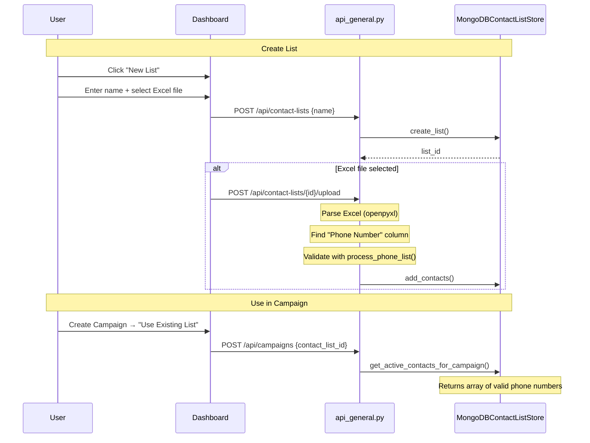

# Contact Lists Flow

Management of reusable contact lists with Excel upload support.

## Data Flow



## Excel File Format

| Column | Required | Description |
|--------|----------|-------------|
| Phone Number | ✅ Yes | Phone numbers (any format) |
| Name | ❌ Optional | Contact name |

The backend accepts any column containing "phone" in the header (case-insensitive).

## Key Files

| File | Purpose |
|------|---------|
| [mongodb_contact_list_store.py](../databases/mongodb_contact_list_store.py) | CRUD operations |
| [phone_validator.py](../utils/phone_validator.py) | Phone number validation |
| [api_general.py](../api_general.py) | Upload endpoint |

## Database Schema

### `contact_lists` Collection
```json
{
  "_id": ObjectId,
  "name": "VIP Customers",
  "userId": "user123",
  "contact_count": 500,
  "version": 1,
  "created_at": "...",
  "updated_at": "..."
}
```

### `contacts` Collection
```json
{
  "_id": ObjectId,
  "list_id": ObjectId,
  "phone_number": "+15551234567",
  "normalized_phone": "+15551234567",
  "name": "John Doe",
  "status": "active|invalid"
}
```

## API Endpoints

| Method | Endpoint | Purpose |
|--------|----------|---------|
| GET | `/api/contact-lists` | List all contact lists |
| POST | `/api/contact-lists` | Create new list |
| POST | `/api/contact-lists/{id}/upload` | Upload Excel file |
| GET | `/api/contact-lists/{id}/contacts` | Get contacts in list |
| DELETE | `/api/contact-lists/{id}` | Delete list |
