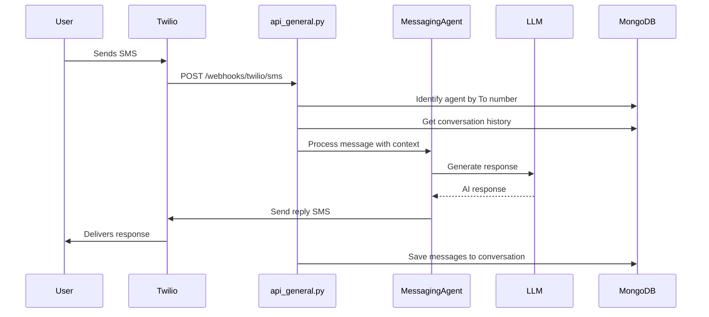

# SMS Incoming Flow

Handles incoming SMS messages via Twilio webhooks, stores conversation history, and generates AI responses.

## Data Flow

## Key Files

| File | Purpose |
|------|---------|
| [api_general.py](../api_general.py) | `/webhooks/twilio/sms` - Webhook handler |
| [mongodb_message_store.py](../databases/mongodb_message_store.py) | Conversation storage |

## Database Collections

| Collection | Data Stored |
|------------|-------------|
| `messages` | from, to, body, channel (sms), timestamp, direction |
| `conversations` | Grouped messages by phone number pair |

## API Endpoints

| Method | Endpoint | Purpose |
|--------|----------|---------|
| POST | `/webhooks/twilio/sms` | Twilio calls this for incoming SMS |
