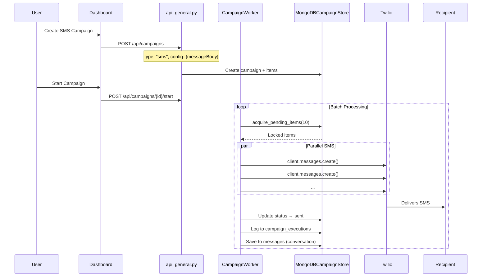

# SMS Outgoing Flow

Handles outbound SMS messages through campaigns or direct sends.

## Data Flow

## Key Files

| File | Purpose |
|------|---------|
| [campaign_worker.py](../utils/campaign_worker.py) | `_send_sms()` method |
| [mongodb_campaign_store.py](../databases/mongodb_campaign_store.py) | Campaign storage |
| [mongodb_message_store.py](../databases/mongodb_message_store.py) | Conversation history |

## Database Collections

| Collection | Data Stored |
|------------|-------------|
| `campaign_items` | phone_number, status |
| `campaign_executions` | message_sid, status, from/to |
| `messages` | Outbound message stored in conversation |

## Message Body Template

The `messageBody` in campaign config is sent as-is to all recipients. Future enhancement: variable substitution (e.g., {{name}}).
