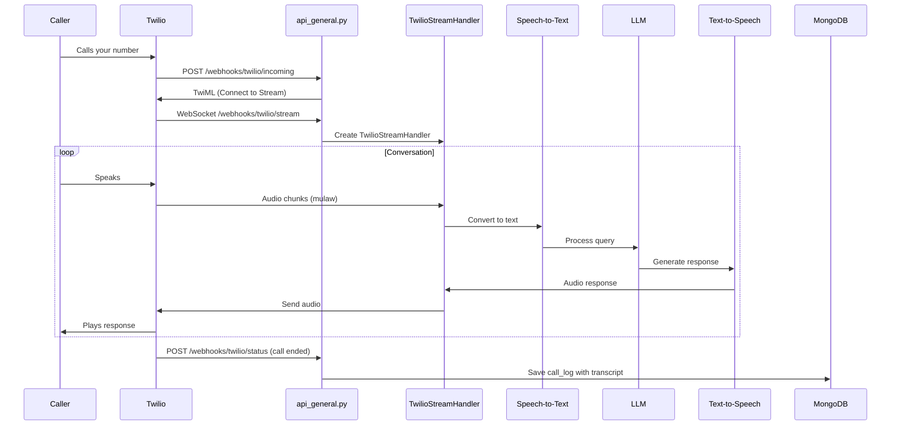

# Voice Incoming Flow

Handles incoming phone calls from Twilio, including real-time speech-to-text, LLM processing, and text-to-speech responses.

## Data Flow

## Key Files

| File | Purpose |
|------|---------|
| [api_general.py](../api_general.py) | `/webhooks/twilio/incoming` - Entry point |
| [twilio_stream_handler.py](../handlers/twilio_stream_handler.py) | WebSocket audio processing |
| [stt_provider_factory.py](../utils/stt_provider_factory.py) | Speech-to-Text providers |
| [tts_provider_factory.py](../utils/tts_provider_factory.py) | Text-to-Speech providers |

## Database Collections

| Collection | Data Stored |
|------------|-------------|
| `call_logs` | Call SID, from/to numbers, duration, transcript, status |

## API Endpoints

| Method | Endpoint | Purpose |
|--------|----------|---------|
| POST | `/webhooks/twilio/incoming` | Twilio calls this when a call comes in |
| WS | `/webhooks/twilio/stream` | Real-time audio bidirectional stream |
| POST | `/webhooks/twilio/status` | Call status updates (completed, failed) |
