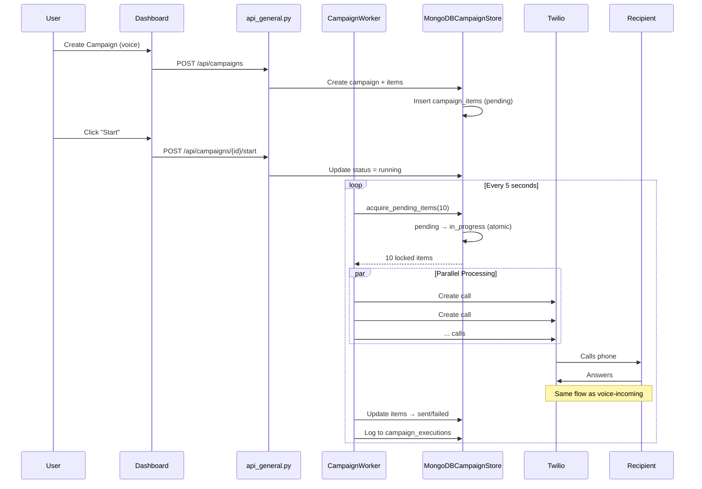

# Voice Outgoing Flow

Handles outbound voice calls initiated through campaigns, including automated dialing and AI conversation.

## Data Flow

## Key Files

| File | Purpose |
|------|---------|
| [campaign_worker.py](../utils/campaign_worker.py) | Background worker for processing |
| [mongodb_campaign_store.py](../databases/mongodb_campaign_store.py) | Campaign & items storage |
| [mongodb_campaign_execution_store.py](../databases/mongodb_campaign_execution_store.py) | Execution logging |

## Database Collections

| Collection | Data Stored |
|------------|-------------|
| `campaigns` | name, type, config, status, stats, progress_percent |
| `campaign_items` | phone_number, status (pending/in_progress/sent/failed) |
| `campaign_executions` | Detailed logs for each call attempt |

## Crash Recovery

On worker startup:
1. Find all campaigns with status `running`
2. Reset any items stuck in `in_progress` → `pending`
3. Resume processing from where it left off

## Configuration

| Env Variable | Default | Description |
|--------------|---------|-------------|
| `CAMPAIGN_BATCH_SIZE` | 10 | Items processed in parallel |
| `CAMPAIGN_ITEM_DELAY_SECONDS` | 1 | Delay between batches |
