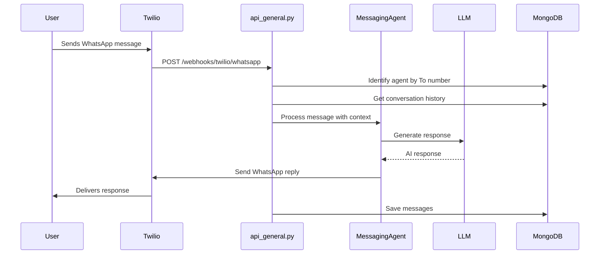

# WhatsApp Incoming Flow

Handles incoming WhatsApp messages via Twilio webhooks.

## Data Flow

## Key Files

| File | Purpose |
|------|---------|
| [api_general.py](../api_general.py) | `/webhooks/twilio/whatsapp` - Webhook handler |
| [mongodb_message_store.py](../databases/mongodb_message_store.py) | Conversation storage |

## Database Collections

| Collection | Data Stored |
|------------|-------------|
| `messages` | from, to, body, channel (whatsapp), timestamp |

## WhatsApp Format

Numbers are prefixed with `whatsapp:` when communicating with Twilio:
- From: `whatsapp:+15551234567`
- To: `whatsapp:+15559876543`
