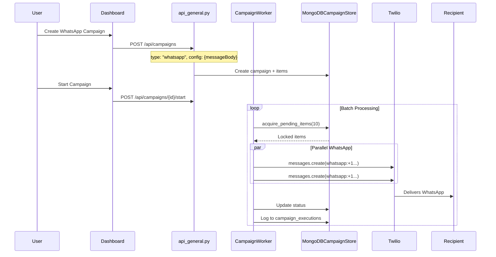

# WhatsApp Outgoing Flow

Handles outbound WhatsApp messages through campaigns.

## Data Flow



## Key Files

| File | Purpose |
|------|---------|
| [campaign_worker.py](../utils/campaign_worker.py) | `_send_whatsapp()` method |

## WhatsApp Format

The worker automatically adds the `whatsapp:` prefix:
```python
whatsapp_from = f"whatsapp:{from_number}"
whatsapp_to = f"whatsapp:{to_number}"
```

## Important Notes

- WhatsApp requires a pre-approved template for initiating conversations
- After a user replies, you have a 24-hour window for free-form messages
- The current implementation sends the `messageBody` as-is
